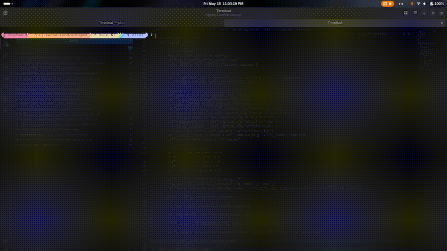

# Face Recognition System

## 1. Folder contains the complete face recognition pipeline build on top of InsightFace and FAISS

The system supports:
- Auto dataset collection from webcam
- Face alignment and preprocessing
- Embedding generation using pretrained ArcFace
- FAISS vector indexing
- Realtime face recognition inference
- Local pretrained model management

## Demo



## 2. Architecture Overview

```text
Webcam
   ↓
InsightFace Detection
   ↓
Face Alignment
   ↓
ArcFace Embedding Extraction
   ↓
FAISS Similarity Search
   ↓
Identity Matching
```

## 3. Pretrained Workflow

This project currently uses pretrained InsightFace models, used is: "buffalo_l"
Following some step below:

- step 1: Download pretrained model:
    `core.face_recognition.download.download_model.py`

- step 2: Automatic collect dataset
    `core.face_recognition.enrollment.faceid_enrollment.py`

- step 3: Face Alignment
    `core.face_recognition.preprocess.align_face.py`

- step 4: Generate Embeddings
    `core.face_recognition.preprocess.generate_embeddings.py`

- step 5: Build FAISS index
    `core.face_recognition.preprocess.build_faiss_indexes.py`

## 4. Folder Struture

```text
face_recognition/
├── configs/
│   ├── common.yml
│   ├── export_onnx.yml
│   └── export_tensorRT.yml
│
├── download/
│   ├── download_model.py
│   └── __init__.py
│
├── enrollment/
│   ├── faceid_enrollment.py
│   └── __init__.py
│
├── export/
│   ├── export_onnx.py
│   └── export_tensorRT.py
│
├── inference/
│   └── __init__.py
│
├── models/
│   ├── backbones/
│   │   ├── iresnet.py
│   │   ├── mobilefacenet.py
│   │   └── partial_fc.py
│   │
│   ├── heads/
│   │   ├── adaface_head.py
│   │   ├── arcface_head.py
│   │   └── cosface_head.py
│   │
│   ├── inference/
│   │   ├── embedding_model.py
│   │   ├── face_aligner.py
│   │   └── face_detector.py
│   │
│   ├── losses/
│   │   ├── arcface_loss.py
│   │   └── triplet_loss.py
│   │
│   └── __init__.py
│
├── preprocess/
│   ├── align_face.py
│   ├── blur_detector.py
│   ├── brightness_checker.py
│   ├── build_dataset.py
│   ├── crop_face.py
│   ├── detect_face.py
│   ├── generate_pairs.py
│   ├── pose_validator.py
│   └── __init__.py
│
├── serving/
│   ├── realtime_inference.py
│   └── __init__.py
│
├── training/
│   ├── full_train/
│   │
│   └── pretrained/
│       ├── build_faiss_indexes.py
│       ├── generate_embeddings.py
│       └── __init__.py
│
├── ui/
│   ├── control_panel.py
│   ├── main_window.py
│   ├── progress_panel.py
│   ├── webcam_panel.py
│   └── __init__.py
│
├── utils/
│   ├── config.py
│   └── __init__.py
│
└── __init__.py
```

## 5. Enrollment Layout

```text
┌────────────────────┬──────────────────────────────────────┬─────────────────────────────┐
│                    │                                      │                             │
│   MENU PANEL       │         CAMERA FRAME PANEL           │      PROCESSING PANEL       │
│                    │                                      │                             │
│  [Enrollment]      │                                      │   ┌─────────────────────┐   │
│  [Advance]         │                                      │   │ Webcam | Upload     │   │
│                    │                                      │   └─────────────────────┘   │
│                    │                                      │                             │
│                    │                                      │                             │
│                    │        LIVE CAMERA STREAM            │                             │
│                    │                                      │                             │
│                    │     + Face Guide Overlay             │                             │
│                    │     + Pose Instruction               │                             │
│                    │     + Auto Capture Indicator         │                             │
│                    │                                      │                             │
│                    │                                      │                             │
│                    │                                      │                             │
│                    │                                      │                             │
│                    │                                      │                             │
│                    │                                      │                             │
│                    │                                      │                             │
│                    │                                      │                             │
├────────────────────┤                                      │                             │
│ Status             │                                      │                             │
│ - Camera Ready     │                                      │                             │
│ - Model Loaded     │                                      │                             │
│ - Device: Webcam0  │                                      │                             │
└────────────────────┴──────────────────────────────────────┴─────────────────────────────┘
```
